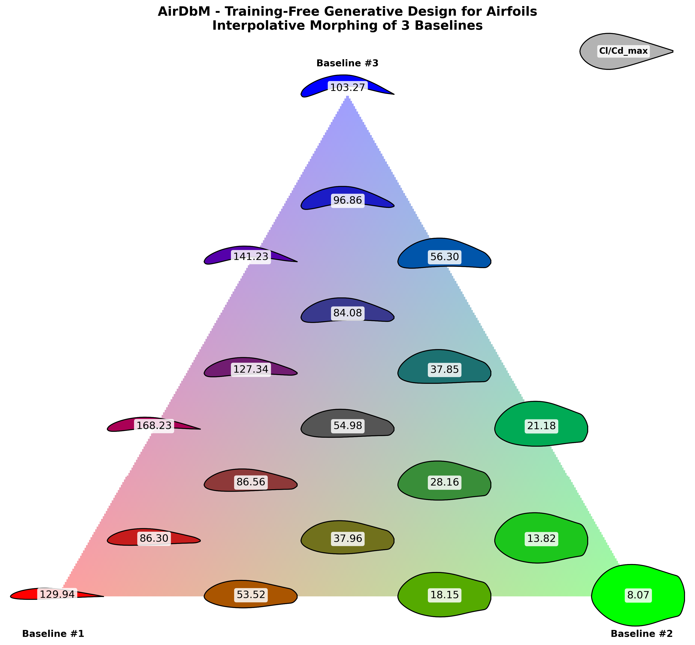

# AirDbM-Bench

AirDbM is a Python interface that designs airfoils by Design-by-Morphing (DbM) and evaluates them with XFOIL. A design vector in `[0, 1]^D` sets the weights of `D` baseline airfoils, the weighted blend is repaired into a valid section, and XFOIL scans the angle of attack to return the peak lift-to-drag ratio and, for two objectives, the stall margin. The same interface runs AirDbM-Bench, twelve frozen optimization problems in which every objective value is computed by a live XFOIL solve. The code was ported to Python from the MATLAB implementation in the parent [AirDbM](https://github.com/UCBCFD/AirDbM) repository, which accompanies the article that introduced the compact 12-baseline set.

  <kbd>
    
  </kbd>

 

If this repository helps your research, publication or benchmark, please cite our AirDbM papers:
- Lee, S. & Sheikh, H. M. (2026). Airfoil Optimization using Design-by-Morphing with Minimized Design-Space Dimensionality. *Journal of Computational Design and Engineering*, 13(1), 108-124. 
- Sheikh, H. M., Lee, S., Wang, J., & Marcus, P. S. (2023). Airfoil Optimization using Design-by-Morphing. *Journal of Computational Design and Engineering*, 10(4), 1443–1459. 

## Using the Python API

The evaluator needs Python 3.10 (we test with 3.10.12) and [Apptainer](https://apptainer.org/docs/). Install the packages with `pip install -r requirements.txt`, then build the XFOIL image with `make xfoil-apptainer-build` and check that XFOIL starts inside it with `make xfoil-apptainer-check`. The image is built from `bin/containers/xfoil-ubuntu22.def` on Ubuntu 22.04, and `TestAirfoils` uses it by default, the recommended mode for reproducible results across systems. A local XFOIL binary works too if you set `xfoil_backend` to `'native'`. To run the benchmark optimizers, `pip install -e ".[bench]"` also installs pymoo, cma and optuna.

A call takes a batch of design vectors, one per row, and returns one result per row:

~~~python
import numpy as np
from airdbm_core import TestAirfoils

x = np.array([[2/3] * 3]) # Equal-weight interpolative morphing
results = TestAirfoils(x) # Call the AirDbM API (design & eval)

cl_cd_max, _ = results[0].objectives
print(f"Cl/Cd max: {cl_cd_max:.2f}") # >>>>>>> Cl/Cd max: 54.98
~~~

The rows of a batch run in parallel with one XFOIL process per core, so a batch no larger than the core count takes about as long as a single design. The next example evaluates four random designs with twelve parameters and changes a few defaults on the way:

~~~python
import numpy as np
from airdbm_core import TestAirfoils

rng = np.random.default_rng(seed=32)

# Example: 4 design candidates (N=4), using 12 input parameters (D=12).
candidate_weights = rng.uniform(0.0, 1.0, size=(4, 12))

# Override some default arguments based on needs
args = {
    'dbm_weight_range': [-1.0, 1.0], # allow both interpolative and extrapolative morphing during DbM
    'dbm_normalization': 'ABS_SUM', # enforce L1-style normalization: sum(|w_i|) = 1 across baselines
    'reynolds': 1e5, # override the Reynolds number (default is 1e6)
}

# Run the API for Bi-Objective evaluation (m=2)
results = TestAirfoils(candidate_weights, args=args, m=2)

for i, res in enumerate(results):
    cl_cd_max, delta_alpha = res.objectives
    print(
        f"Candidate {i+1} ({res.airfoil.name}) -> "
        f"Cl/Cd max: {cl_cd_max:.2f}, Stall Margin (deg): {delta_alpha:.2f}"
    )
~~~

## API arguments

~~~python
TestAirfoils(x: np.ndarray, args: dict | None = None, m: int = 2) -> list
~~~

`x` is an `N x D` array with entries in `[0.0, 1.0]`, `N` designs of `D` parameters each. `m` selects one objective (peak `Cl/Cd`) or two (peak `Cl/Cd` and stall margin). `args` is a dictionary that overrides any of the defaults below.

**Airfoil design**

| Key | Type | Default | Description |
|---|---|---|---|
| `airfoil_db_dir` | `str` | `'airfoilDB'` | Folder of baseline coordinate files. |
| `dbm_baselines` | `list[str]` | the internal `EXPECTED_BASELINES` list | Ordered baseline names. A design with `D` parameters uses the first `D`. The default list is the optimal baseline set of our [2026 paper](https://doi.org/10.1093/jcde/qwaf124). |
| `dbm_weight_range` | `list[float]` | `[-1.0, 1.0]` | Linear map from `x` in `[0.0, 1.0]` to morphing weights. It must cover `[0.0, 1.0]`. |
| `dbm_normalization` | `str \| None` | `None` | Weight normalization: `None`, `'SUM'` or `'ABS_SUM'`. |

**Airfoil evaluation**

| Key | Type | Default | Description |
|---|---|---|---|
| `xfoil_evaluation` | `bool` | `True` | If `False`, only the geometry is generated. |
| `xfoil_backend` | `str` | `'apptainer'` | `'apptainer'`, `'native'`, or `'auto'` (the image first, then a system `xfoil`). |
| `apptainer_image` | `str` | `'bin/xfoil-ubuntu22.sif'` | Path to the Apptainer image. |
| `xfoil_iter` | `int` | `200` | Maximum XFOIL iterations per angle. |
| `repanel_n` | `int` | `160` | Panel node count XFOIL repanels to before the scan. |
| `xfoil_timeout` | `float` | `60.0` | Timeout in seconds per XFOIL run; `0.0` turns it off. |
| `xfoil_retry` | `int` | `1` | Reattempts when no polar point is parsed at all, a transient case under multiprocessing. |
| `xfoil_strict` | `bool` | `True` | If `True`, an XFOIL error raises; otherwise the error is attached to the result. |
| `alfa_start` | `float` | `0.0` | First angle of attack of the scan (deg). |
| `alfa_end` | `float` | `45.0` | Last angle of attack of the scan (deg). |
| `reynolds` | `float` | `1e6` | Chord Reynolds number. |
| `mach` | `float` | `0.0` | Mach number; `0.0` means incompressible flow. |
| `n_crit` | `float` | `9.0` | e^N transition amplification factor. |
| `clcd_ceiling` | `float` | `350.0` | Upper clip on `Cl/Cd` against solver blow-ups. |

**Multiprocessing**

| Key | Type | Default | Description |
|---|---|---|---|
| `parallel` | `bool` | `True` | Evaluate the rows of a batch in parallel. |
| `max_workers` | `int` | all available CPUs | Maximum worker processes, capped by the CPUs the process may use. |

`TestAirfoils` returns a list of `N` `AirfoilEvaluationResult` objects. Each has `.airfoil`, the generated `Airfoil` (its `.name`, the arrays `.x_raw` and `.y_raw`, `.get_raw_coordinates()` and `.plot(save_path=...)`), `.xfoil_result`, the raw XFOIL metrics with the full polar (or `None` without evaluation), and `.objectives`, which is `Cl/Cd_max` for `m=1` and `[Cl/Cd_max, delta_alpha]` for `m=2`.

The first objective is the largest lift-to-drag ratio over the scan,

$$
\left(\frac{C_l}{C_d}\right)_{\max}
= \max_{\alpha}\left(\frac{C_l(\alpha)}{C_d(\alpha)}\right),
$$

and the second is the stall margin,

$$
\Delta\alpha = \alpha_{\mathrm{stall}} - \alpha_{\left(\frac{C_l}{C_d}\right)_{\max}},
$$

where $\alpha_{\mathrm{stall}}$ is the first local maximum of $C_l$ found while moving up in angle of attack from the peak-efficiency angle, or the angle of maximum $C_l$ when no local maximum turns up. Both angles are read on a validity-filtered and smoothed polar so that one noisy sample does not count as a peak, while the ratio returned is the raw value at the chosen angle. The `clcd_ceiling` clip acts from above only, so a section with negative lift at every angle of the scan returns a negative ratio. The benchmark wrapper in `bench/problems.py` applies its own objective floor; `TestAirfoils` applies none.

~~~python
VerifyDesigns(x, args=None, m=2, eps=1e-6, n_dir=4, rel_tol=0.02, objective=0, directions="axes", seed=0)
~~~

`VerifyDesigns` checks designs before you report them as reference solutions. XFOIL can converge to two different boundary-layer solutions for nearly identical sections, and an isolated design can then score far above all of its neighbors. Such a value repeats on every call but no search can reach it.

With `directions="axes"` the function evaluates the `2D` neighbors `x ± eps·e_i`; `"random"` draws `n_dir` directions from `seed` instead. A design is `robust` when at least two neighbors converge and the median neighbor matches the design within `rel_tol` on the objective `objective`.

Each result also reports `rel_dev`, `abs_dev`, `median_neighbor`, `rel_dev_quantiles`, `frac_within_tol` and `n_informative`, so a threshold can be changed later without new solves.

A check costs `1 + 2D` evaluations per design (9, 17 and 25 at `D` = 4, 8 and 12), which is why it is kept out of `TestAirfoils`. Pass the same `args` the design was optimized under, since a different normalization or weight range gives a different geometry.

~~~python
import numpy as np
from airdbm_core import VerifyDesigns

x_best = np.array([[2/3, 2/3, 2/3]])           # the designs you are about to publish

v = VerifyDesigns(x_best, m=2)                 # -> one verdict dict per design
[(r['robust'], round(max(r['rel_dev']), 4)) for r in v]
# >>>>>>> [(True, 0.0)]
~~~

## Benchmark

AirDbM-Bench fixes twelve problems on this interface. They cross two objective forms (peak `Cl/Cd` only, or together with the stall margin), three nested dimensions (`D` = 4, 8 and 12, the first `D` baselines of the default list) and two operating conditions: Ma 0.20 at Re_c 1e6, a wind-tunnel model, and Ma 0.40 at Re_c 1e7, a regional turboprop in cruise.

A problem is named `ADO-<O>-<C>-<N>`, with `O` = `S` or `M` for single or multi-objective, `C` = `2` or `4` for the Mach number, and `N` = `1`, `2` or `3` for `D` = 4, 8 or 12. Each problem allows `1024·D` evaluations.

Each problem's folder in `bench/` contains the run scripts of the five released optimizers and their histories over five seeds, the stability gate `gate.json` and the reference optimum or front in `data.json`. The bi-objective folders also contain `refine.py` and the refinement samples that built the front.

The GitHub repository leaves these histories and refinement samples out; they are distributed in the data archive `data.tar.gz`, which unpacks into `bench/` from the repository root. [`bench/README.md`](bench/README.md) lists the `TestAirfoils` arguments behind each problem and explains how to run and score a new optimizer.

## Customizing the baselines

The twelve default baselines come from the [UIUC Airfoil Coordinates Database](https://m-selig.ae.illinois.edu/ads.html), and any other section from that database can be added the same way.

To add a section, download its coordinate file in Selig format (`.dat`), put it in `airfoilDB/` or in another folder that you pass as `airfoil_db_dir`, and list the baselines you want in `dbm_baselines`. Each name is the first line of its `.dat` file. Keep the order in mind, since a design with `D` parameters uses the first `D` names.

The parsed database is cached in `_db.pkl` inside the folder and the cache does not check file contents, so delete `<airfoil_db_dir>/_db.pkl` after adding or editing a file, or the new baseline is reported as missing. The loaded set is also kept for the life of the process, and a process that reads one folder and then another keeps using the first.

~~~python
args = {
    'airfoil_db_dir': 'airfoilDB',
    'dbm_baselines': [
        'E195  (11.82%)',
        'FX 79-W-660A',
        'GOE 531 AIRFOIL',
        'EPPLER 864 STRUT AIRFOIL',
    ],
}
~~~

## Parallel scaling test

We timed `TestAirfoils` on one node with two 64-core AMD EPYC Milan processors at 2.45 GHz (128 cores), evaluating both objectives (`m=2`) with 1 (serial), 2, 4, 8, 16, 32, 64 and 128 workers.

<!-- SCALING:BEGIN (regenerated from the recorded scaling measurements; do not edit by hand) -->

### Weak Scaling

Design candidates per worker: `24`. Every worker count draws its load as a nested prefix of one fixed i.i.d. design pool, so the workload composition is identical at every point and the expected time is flat.

| workers | candidates | time (sec) | sec/design | throughput (eval/sec) |
|---:|---:|---:|---:|---:|
| 1 | 24 | 311.950 | 12.998 | 0.08 |
| 2 | 48 | 318.825 | 13.284 | 0.15 |
| 4 | 96 | 324.722 | 13.530 | 0.30 |
| 8 | 192 | 319.867 | 13.328 | 0.60 |
| 16 | 384 | 313.963 | 13.082 | 1.22 |
| 32 | 768 | 316.052 | 13.169 | 2.43 |
| 64 | 1536 | 331.886 | 13.829 | 4.63 |
| 128 | 3072 | 411.335 | 17.139 | 7.47 |

### Strong Scaling

Total design candidates: `384` (the same set at every worker count).

| workers | candidates | time (sec) | speedup | efficiency |
|---:|---:|---:|---:|---:|
| 1 | 384 | 4921.202 | 1.00 | 1.000 |
| 2 | 384 | 2465.182 | 2.00 | 0.998 |
| 4 | 384 | 1240.874 | 3.97 | 0.991 |
| 8 | 384 | 626.653 | 7.85 | 0.982 |
| 16 | 384 | 320.502 | 15.35 | 0.960 |
| 32 | 384 | 165.232 | 29.78 | 0.931 |
| 64 | 384 | 91.000 | 54.08 | 0.845 |
| 128 | 384 | 60.819 | 80.92 | 0.632 |
<!-- SCALING:END -->
